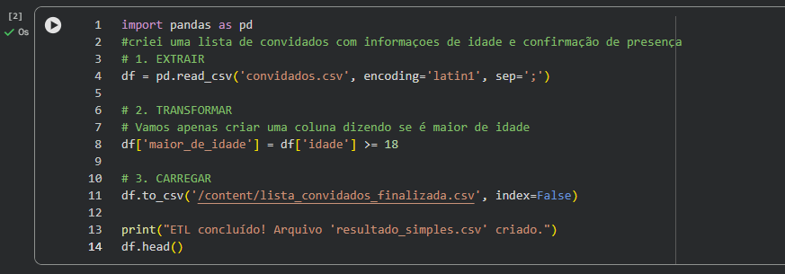
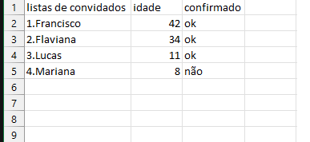
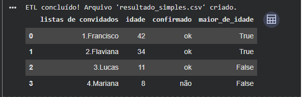

# 📊 Projeto ETL: Processamento de Dados com Python e Pandas

## 📝 Descrição do Projeto

Este projeto foi desenvolvido como parte do **Bootcamp Santander 2025
**, focado em demonstrar o ciclo de vida de um processo de **ETL** (Extração, Transformação e Carga). O objetivo principal é automatizar o tratamento de uma lista de convidados, transformando dados brutos num relatório higienizado e pronto para análise.

## 🛠️ Tecnologias Utilizadas

* **Linguagem:** Python 3.x
* **Biblioteca Principal:** [Pandas](https://pandas.pydata.org/) (Manipulação e análise de dados)
* **Ambiente:** Google Colab

## ⚙️ O Fluxo ETL

### 1. Extração (Extract)

A origem dos dados é um ficheiro `convidados.csv`. O script faz a leitura automática deste ficheiro, convertendo-o num DataFrame do Pandas para manipulação em memória.

### 2. Transformação (Transform)

Nesta etapa, os dados brutos passam por regras de negócio:

* **Limpeza:** Padronização de nomes e tratamento de valores ausentes.
* **Lógica de Negócio:** Criação de colunas calculadas (ex: verificação de maioridade ou classificação de convidados).
* **Filtragem:** Seleção apenas das informações relevantes para o relatório final.

### 3. Carga (Load)

Os dados transformados são exportados para um novo ficheiro CSV (`resultado_final.csv`), garantindo a persistência da informação processada para uso em ferramentas de BI ou dashboards.

## 🚀 Como Executar o Projeto

1. Faça o upload do arquivo `convidados.csv` para o seu ambiente (Google Colab ou local).
2. Execute o script Python `etl_projeto.py`.
3. Verifique o novo arquivo gerado na sua pasta de saída.

## 📈 Conclusão

Este projeto demonstra como a automação de dados substitui processos manuais repetitivos, reduzindo erros humanos e aumentando a eficiência no tratamento de grandes volumes de informação.

